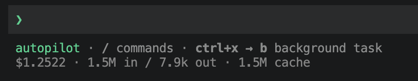
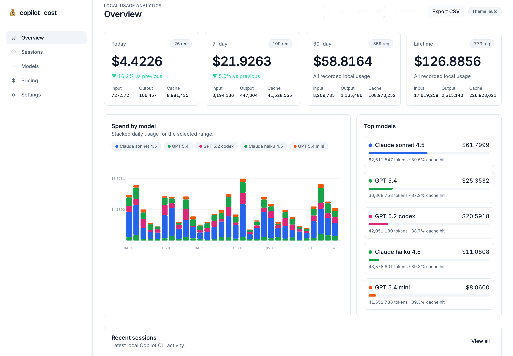
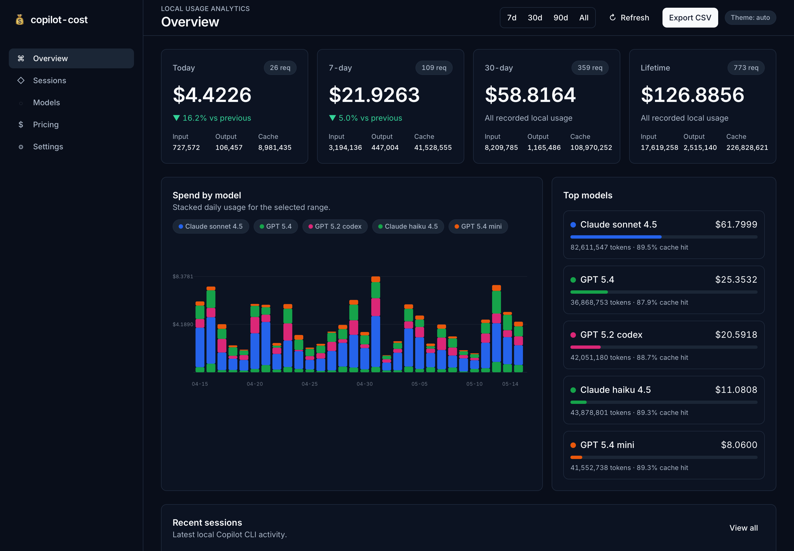

# 💸 copilot-cost

> **See your GitHub Copilot CLI tokens and estimated spend at a glance — right in your terminal.**

[](LICENSE)
[](https://nodejs.org)
[](https://opentelemetry.io)
[](#-privacy)

> ⚠️ **Unofficial estimate, not a bill.** This is a community project and is **not affiliated with, endorsed by, or supported by GitHub**. Displayed costs are calculated locally from Copilot CLI OpenTelemetry token counters and the public per-model prices declared by GitHub in its [Copilot models & pricing](https://docs.github.com/en/copilot/reference/copilot-billing/models-and-pricing) documentation. They are estimates only and may differ from what GitHub bills or reports in your organization account.

A zero-config **statusline + local dashboard** that turns Copilot CLI's OpenTelemetry traces into a real-time, model-aware view of your **token usage and estimated USD / GitHub AI Credits (AIC)** — without your data ever leaving your machine.



---

## 🚀 Install

> **Prerequisite:** update the GitHub Copilot CLI to the **latest version** first — older releases may not emit the OpenTelemetry spans this tool depends on.
>
> The package is not published to a registry yet. Install it locally from this repository.

```bash
git clone https://github.com/devartifex/copilot-cost.git
cd copilot-cost
npm run setup       # installs deps, builds, links the `copilot-cost` command, runs install + doctor
```

> Prefer manual control? The equivalent steps are `npm install && npm run build && npm link && copilot-cost install`.

Then **restart your shell and restart `copilot`**. That's it.

The installer configures the Copilot CLI statusline (including the required `"experimental": true` flag in `~/.copilot/settings.json` — the GitHub Copilot CLI gates custom status lines behind that flag), appends an idempotent OpenTelemetry block to your shell profile, and enables local JSONL span output under `~/.copilot/otel/`. It does **not** start the dashboard.

Prefer to edit your shell profile yourself? Run `copilot-cost install --no-otel-profile` — the OpenTelemetry block is printed for manual setup.

Verify any time with:

```bash
copilot-cost doctor
```

---

## 🎨 Statusline

Three styles, controlled by `COPILOT_COST_FORMAT`:

| Format | Aliases | Example |
| --- | --- | --- |
| `standard` | _default_ | `$1.2522 · 125.22 AIC · 1.5M in / 7.9k out · 1.5M cache` |
| `compact` | `minimal` | `$1.2522` |
| `full` | `verbose` | `$1.2522 · 125.22 AIC · 38.4k fresh / 1.4M cache rd / 62.1k cache wr / 7.9k out · Σ 1.5M · 1.6k reason` |

```bash
export COPILOT_COST_FORMAT=compact
```

Cost metric display is controlled by `COPILOT_COST_METRIC`:

| Metric | Example effect |
| --- | --- |
| `usd` | Show estimated dollars only, e.g. `$1.2522`. This is the default for `compact` / `minimal`; `dollar` and `dollars` are aliases. |
| `aic` | Show AI Credits only, e.g. `125.22 AIC`; `credits` and `ai_credits` are aliases. |
| `both` | Show dollars and AI Credits, e.g. `$1.2522 · 125.22 AIC`. This is the default for `standard` and `full`; `all` is an alias. |

```bash
export COPILOT_COST_METRIC=aic
```

Other knobs:

- `COPILOT_COST_NO_COLOR=1` (or `NO_COLOR=1`) — plain output.
- `COPILOT_COST_COLOR=<ansi-code>` — change the statusline color.
- `COPILOT_COST_HIDE_ZERO=1` — hide the zeroed placeholder shown before the first response.

---

## 📊 Dashboard

```bash
copilot-cost dashboard
```

Binds to `127.0.0.1` by default and shows lifetime / today / week / month totals, token & cost trends, per-session and per-model breakdowns, pricing status, setup health, and CSV export.

|  ☀️ Light  |  🌙 Dark  |
| :---: | :---: |
|  |  |

Use `--port`, `--host 127.0.0.1`, or `--no-open` as needed.

---

## ✨ Why copilot-cost?

- **🔭 Zero-blindspot** — cost and tokens visible on every prompt, not at the end of the month.
- **🔌 OpenTelemetry-native** — no monkey-patching, no proxy, no auth.
- **🔒 100% local** — usage data never leaves your machine; the dashboard binds only to `127.0.0.1`.
- **🧠 Model-aware** — separate accounting for input / output / cached / reasoning tokens.
- **🪶 Lightweight** — no runtime database, no daemon, no analytics.

---

## 🧬 How it works

The Copilot CLI has built-in [OpenTelemetry](https://opentelemetry.io) instrumentation. With a few env vars set, every prompt, tool call, and model response is recorded as a trace span — including token counts and the model that handled it.

```
GitHub Copilot CLI ──OTel spans (JSONL)──▶ ~/.copilot/otel/copilot-otel.jsonl
                                                      │ tail + parse
                          ┌───────────────────────────┴───────────────────────────┐
                          ▼                                                       ▼
                 statusline (render)                                  dashboard (local web UI)
```

1. **Capture** — the installer adds three env vars so the Copilot CLI writes spans to a JSONL file:
   ```bash
   export COPILOT_OTEL_ENABLED=true
   export COPILOT_OTEL_EXPORTER_TYPE=file
   export COPILOT_OTEL_FILE_EXPORTER_PATH="$HOME/.copilot/otel/copilot-otel.jsonl"
   ```
2. **Aggregate** — on every render, recent spans are read, `gen_ai.usage.*` counters and `gen_ai.request.model` are extracted, and rolled up by session / model / day.
3. **Estimate** — token counts are multiplied by prices from GitHub's public [Copilot models & pricing](https://docs.github.com/en/copilot/reference/copilot-billing/models-and-pricing) table to estimate USD and GitHub AI Credits (AIC). The local cache refreshes automatically when it is older than seven days, retains the last-known-good data if GitHub is unavailable, and falls back to the bundled snapshot when no cache exists. Long-context rates are selected from the published input-token thresholds. This is not billing data.
4. **Render** — a one-line statusline, plus an optional local web dashboard.

More on the underlying telemetry pipeline: [Copilot OpenTelemetry observability](https://docs.github.com/en/copilot/how-tos/copilot-sdk/observability/opentelemetry).

---

## 🔒 Privacy

- ✅ Usage data **stays on your machine**.
- ✅ The dashboard only supports local binds (`127.0.0.1` or `localhost`).
- ✅ This package emits **no telemetry or analytics** of its own.
- 🌐 Pricing refresh contacts GitHub's public Docs pricing source only when requested or when the cache needs refreshing.

---

## 🛠️ Commands

| Command | What it does |
| --- | --- |
| `render` | Render the statusline from Copilot CLI status JSON on stdin (default command). |
| `install [--yes] [--no-otel-profile]` | Install the statusline and (unless opted out) append local OpenTelemetry shell profile settings. |
| `uninstall [--yes]` | Remove settings installed by this package when they point at this tool. |
| `doctor` | Check statusline setup, OpenTelemetry output, pricing, and dashboard readiness. |
| `dashboard [--port <n>] [--host <h>] [--no-open]` | Serve the local dashboard. |
| `refresh-pricing [--force]` | Refresh model pricing now; `--force` bypasses the seven-day cache TTL. |

---

## 🩺 Troubleshooting

- **The statusline does not appear.** Run `copilot-cost doctor`. The custom statusline requires `"experimental": true` in `~/.copilot/settings.json` — without it the GitHub Copilot CLI ignores the `statusLine` block entirely (its logs show `STATUS_LINE: false`). Re-running `copilot-cost install` sets both keys; then restart Copilot CLI.
- **No usage shows up yet.** Make sure you're on the latest Copilot CLI, restart your shell and `copilot`, send a prompt, then check for JSONL files in `~/.copilot/otel/`.
- **I do not want profile edits.** Use `copilot-cost install --no-otel-profile` and paste the printed OpenTelemetry block into the shell profile you choose.
- **The dashboard will not bind.** Use a local host only, e.g. `copilot-cost dashboard --host 127.0.0.1 --port 4567`.
- **Pricing looks stale.** Run `copilot-cost refresh-pricing --force`. Set `COPILOT_COST_REFRESH_DAYS` to change the automatic refresh interval, or `COPILOT_COST_AUTO_REFRESH=0` to disable automatic refreshes.

---

## 🧪 Development

```bash
npm install
npm test
npm run build
```

---

## 📚 More

- [`CHANGELOG.md`](CHANGELOG.md) — release notes.
- [GitHub Copilot CLI docs](https://docs.github.com/en/copilot/concepts/agents/copilot-cli/about-copilot-cli) · [Copilot OpenTelemetry observability](https://docs.github.com/en/copilot/how-tos/copilot-sdk/observability/opentelemetry) · [Copilot models & pricing](https://docs.github.com/en/copilot/reference/copilot-billing/models-and-pricing)

📄 MIT — see [LICENSE](LICENSE). Not affiliated with GitHub.
