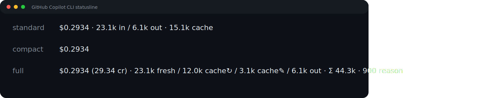

# 💸 copilot-cost

> **See your GitHub Copilot CLI tokens and estimated spend at a glance — right in your terminal.**

[](LICENSE)
[](https://nodejs.org)
[](https://opentelemetry.io)
[](#-privacy-promise)

`copilot-cost` is a **zero-config statusline + local dashboard** for the [GitHub Copilot CLI](https://docs.github.com/en/copilot/concepts/agents/copilot-cli/about-copilot-cli). It watches the OpenTelemetry traces the CLI already emits, and turns them into a real-time, model-aware view of your **token usage and estimated spend** — without ever leaving your machine.

```text
$0.2934 · 23.1k in / 6.1k out · 15.1k cache
```



|  ☀️ Light  |  🌙 Dark  |
| :---: | :---: |
|  |  |

> _Screenshots are generated from synthetic demo telemetry in [`docs/demo-otel/synthetic-usage.jsonl`](docs/demo-otel/synthetic-usage.jsonl). Regenerate them with `npm run screenshots:demo` after cloning the repo._

---

## ✨ Why copilot-cost?

- **🔭 Zero-blindspot** — cost and tokens visible on every prompt, not at the end of the month.
- **🔌 OpenTelemetry-native** — no monkey-patching, no proxy, no auth: it reads the **same JSONL trace files the Copilot CLI already writes**.
- **🔒 100% local** — your usage data never leaves your machine. The dashboard binds only to `127.0.0.1`.
- **🧠 Model-aware** — separate accounting for input / output / cached / reasoning tokens across every Copilot model.
- **📈 Statusline + dashboard** — a glanceable one-liner *and* a deeper view when you want trends and breakdowns.
- **🪶 Lightweight** — no runtime database, no daemon, no analytics. Just files and aggregation on demand.

---

## 🚀 Quickstart

> The package is not published to a registry yet. Install it locally from this repository.

```bash
git clone https://github.com/devartifex/copilot-cost.git
cd copilot-cost
npm install
npm run build
npm link            # makes the `copilot-cost` command available on your PATH
copilot-cost install
```

Then **restart your shell and restart `copilot`**. That's it.

The installer:

- 🔧 Configures the Copilot CLI statusline command
- 📝 Appends an idempotent OpenTelemetry block to your shell profile
- 📁 Enables local JSONL span output under `~/.copilot/otel/`
- 🚫 Does **not** start the dashboard (run it on demand)

Prefer to edit your shell profile yourself?

```bash
copilot-cost install --no-otel-profile
```

That still installs the statusline and prints the OpenTelemetry block for manual setup.

Verify setup any time:

```bash
copilot-cost doctor
```

---

## 🧬 How it works

The Copilot CLI has built-in **[OpenTelemetry](https://opentelemetry.io)** instrumentation. When you set a few env vars, every prompt, tool call, and model response is recorded as a trace span — including token counts and the model that handled it.

`copilot-cost` plugs into that stream end-to-end:

```
┌────────────────────┐    OTel spans (JSONL)    ┌──────────────────────┐
│  GitHub Copilot CLI│ ───────────────────────▶ │  ~/.copilot/otel/    │
└────────────────────┘   COPILOT_OTEL_*=…       │  copilot-otel.jsonl  │
                                                └──────────┬───────────┘
                                                           │ tail + parse
                              ┌────────────────────────────┴──────────────┐
                              ▼                                            ▼
                  ┌────────────────────────┐               ┌───────────────────────────┐
                  │ statusline (render)    │               │ dashboard (local web UI)  │
                  │  • $cost · in/out/cache│               │  • lifetime / today / week│
                  │  • compact / full / std│               │  • per-model & per-session│
                  └───────────┬────────────┘               │  • CSV export             │
                              │                            └───────────────────────────┘
                              ▼
                       Copilot CLI status bar
```

1. **Capture** — the installer adds three env vars to your shell profile so the Copilot CLI writes spans to a JSONL file:
   ```bash
   export COPILOT_OTEL_ENABLED=true
   export COPILOT_OTEL_EXPORTER_TYPE=file
   export COPILOT_OTEL_FILE_EXPORTER_PATH="$HOME/.copilot/otel/copilot-otel.jsonl"
   ```
2. **Aggregate** — on every render the tool reads recent spans, extracts `gen_ai.usage.*` token counters and the `gen_ai.request.model`, and rolls them up by session / model / day.
3. **Price** — token counts are multiplied by a bundled pricing snapshot (refreshable from [GitHub Docs: Copilot models & pricing](https://docs.github.com/en/copilot/reference/copilot-billing/models-and-pricing)) to produce an **estimated** USD cost.
4. **Render** — a one-line statusline for the Copilot CLI status bar, plus an optional local web dashboard for trends.

> 📚 More on the underlying telemetry pipeline: [GitHub Docs — OpenTelemetry observability for Copilot](https://docs.github.com/en/copilot/how-tos/copilot-sdk/observability/opentelemetry).

### 🤔 Why OpenTelemetry (and not API scraping)?

- **It's the official, supported integration point.** GitHub designed the Copilot CLI to emit OTel spans. We don't intercept HTTP, wrap the binary, or parse logs.
- **It's vendor-neutral.** The same JSONL files you give to `copilot-cost` can be sent to Jaeger, Honeycomb, Grafana Tempo, or any OTel collector.
- **It's complete.** Every span carries token counters, model names, timing, and request IDs — exactly what's needed for accurate cost accounting.
- **It's local by default.** The `file` exporter writes to disk on your machine; nothing has to leave the box.

---

## 🎨 Statusline styles

Choose how much detail the statusline shows with `COPILOT_COST_FORMAT`:

| Format | Aliases | Example |
| --- | --- | --- |
| `standard` | _default_ | `$0.2934 · 23.1k in / 6.1k out · 15.1k cache` |
| `compact` | `minimal` | `$0.2934` |
| `full` | `verbose` | `$0.2934 (29.34 cr) · 23.1k fresh / 12.0k cache↻ / 3.1k cache✎ / 6.1k out · Σ 44.3k · 900 reason` |

Set it next to the OpenTelemetry block in your shell profile:

```bash
export COPILOT_COST_FORMAT=compact
```

You can also set `COPILOT_COST_NO_COLOR=1` (or `NO_COLOR=1`) for plain output, and `COPILOT_COST_COLOR=<ansi-code>` to change the statusline color.

---

## 📊 Dashboard

```bash
copilot-cost dashboard
```

Binds to `127.0.0.1` by default, reads local OpenTelemetry JSONL files, and shows:

- 📅 lifetime, today, week, and month totals
- 📈 token and cost trends
- 🧵 session-level usage
- 🤖 model breakdowns
- 🏷️  pricing status
- 🩺 local setup health
- 📤 CSV export

Use `--port`, `--host 127.0.0.1`, or `--no-open` as needed.

---

## 🔒 Privacy promise

- ✅ Usage data **stays on your machine**.
- ✅ The dashboard only supports local binds (`127.0.0.1` or `localhost`).
- ✅ This package emits **no telemetry or analytics** of its own.
- ✅ Runtime usage data is read from local OpenTelemetry JSONL files.
- 🌐 Pricing refresh contacts `docs.github.com` only when requested or when the cache needs refreshing.

---

## 🛠️ Commands

```bash
copilot-cost render
copilot-cost install [--yes] [--no-otel-profile]
copilot-cost uninstall [--yes]
copilot-cost doctor
copilot-cost dashboard [--port <number>] [--host <host>] [--no-open]
copilot-cost refresh-pricing [--force]
copilot-cost migrate
```

| Command | What it does |
| --- | --- |
| `render` | Render the statusline from Copilot CLI status JSON on stdin. This is also the default command. |
| `install` | Install the statusline command and, unless `--no-otel-profile` is used, append local OpenTelemetry shell profile settings. |
| `uninstall` | Remove settings installed by this package when they point at this tool. |
| `doctor` | Check statusline setup, OpenTelemetry output, pricing, and dashboard readiness. |
| `dashboard` | Serve the local dashboard. |
| `refresh-pricing` | Refresh model pricing; `--force` bypasses the cache TTL. |
| `migrate` | Export legacy 0.1.x SQLite data to OpenTelemetry-compatible JSONL snapshots. |

---

## 🩺 Troubleshooting

- **The statusline does not appear.** Run `copilot-cost doctor`, then confirm the Copilot CLI was restarted after install.
- **No usage shows up yet.** Restart your shell, restart `copilot`, send a Copilot CLI prompt, then check for JSONL files in `~/.copilot/otel/`.
- **I do not want profile edits.** Run `copilot-cost install --no-otel-profile` and paste the printed OpenTelemetry block into the shell profile you choose.
- **The dashboard will not bind.** Use a local host only, e.g. `copilot-cost dashboard --host 127.0.0.1 --port 4567`.
- **Pricing looks stale.** Run `copilot-cost refresh-pricing --force`.

---

## 📚 Deeper docs

- [`CHANGELOG.md`](CHANGELOG.md) — release notes.
- [`docs/statusline-preview.txt`](docs/statusline-preview.txt) — text preview used by docs.
- [`docs/statusline-styles.svg`](docs/statusline-styles.svg) — terminal-style preview of every statusline format.
- [`docs/demo-otel/synthetic-usage.jsonl`](docs/demo-otel/synthetic-usage.jsonl) — synthetic demo data for screenshots.
- 🔗 [GitHub Copilot CLI docs](https://docs.github.com/en/copilot/concepts/agents/copilot-cli/about-copilot-cli) · [Copilot OpenTelemetry observability](https://docs.github.com/en/copilot/how-tos/copilot-sdk/observability/opentelemetry) · [Copilot models & pricing](https://docs.github.com/en/copilot/reference/copilot-billing/models-and-pricing)

---

## 🧪 Development

```bash
npm install
npm test
npm run build
```

---

📄 MIT — see [LICENSE](LICENSE).
